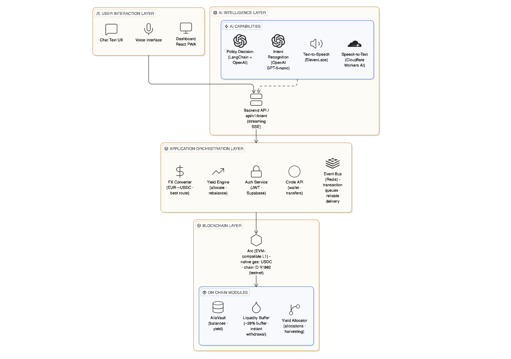
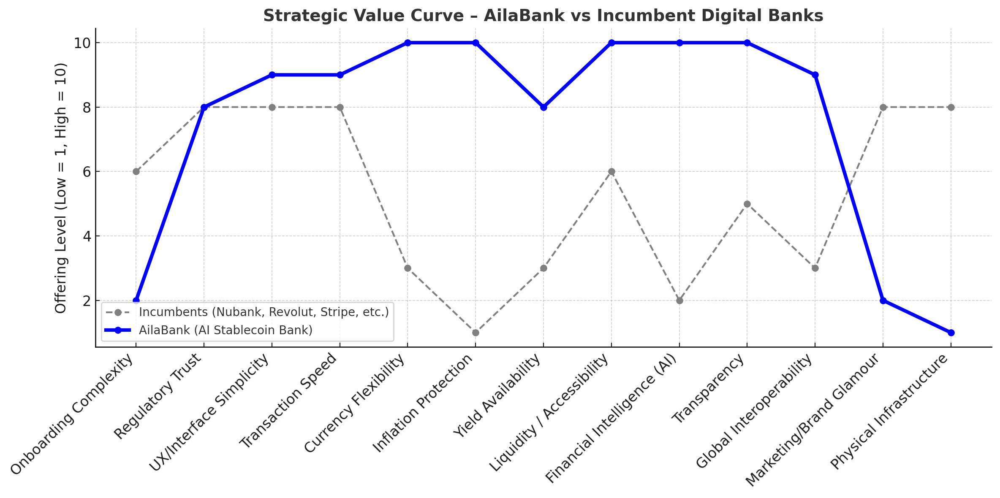

# 🏦 AilaBank — AI-Native Stablecoin Bank

**A voice-first, AI-powered stablecoin banking platform that standardizes any-currency value to USDC on Arc, routes cross-border payments intelligently, auto-sweeps idle funds to optimal yield, and provides merchants with zero-MDR settlements via yield-share — all with on-chain transparency and instant global liquidity.**

[](https://opensource.org/licenses/MIT)
[](https://www.typescriptlang.org/)
[](https://reactjs.org/)
[](https://nodejs.org/)

**See demo and full case study:** [pedrorodas.com/projects](https://www.pedrorodas.com/#projects)

---

## 📋 Table of Contents

- [Project Overview](#-project-overview)
- [Core Features](#-core-features)
- [Architecture](#-architecture)
- [Tech Stack](#-tech-stack)
- [Quick Start](#-quick-start)
- [Setup Guide](#-setup-guide)
- [API Documentation](#-api-documentation)
- [Development Workflow](#-development-workflow)
- [Deployment](#-deployment)
- [Contributing](#-contributing)
- [License](#-license)

---

## 🎯 Project Overview

See demo and full case study: [pedrorodas.com/projects](https://www.pedrorodas.com/#projects)

### Vision

AilaBank reimagines banking for the digital age by combining:
- **AI-Native Intelligence**: Voice-first interface powered by advanced LLMs
- **Blockchain Transparency**: All transactions verifiable on-chain
- **Best-Rate Guarantee**: Automated routing to optimal payment corridors
- **Yield Optimization**: Intelligent fund allocation with instant liquidity
- **Zero-MDR for Merchants**: Yield-share offsets transaction fees

### Strategic Differentiators (Blue Ocean Strategy)

| Eliminate | Reduce | Raise | Create |
|-----------|--------|-------|--------|
| Physical banking, cards, hidden FX fees | Glam branding, gamified UX, MDR reliance | Transparency, liquidity, voice UX | RateSweep™ engine, in-flight yield, corridor-aware routing |
| Complex KYC, manual money moves | Fiat rail dependence | Best-rate routing, proof-of-best-execution | Public reliability/cost dashboard |

### MVP Goals

- **Cross-Border Payments**: Any-currency in → USDC core → any-currency out
- **Store of Value**: Inflation-aware, always-liquid USDC with AI-managed yield
- **Merchant Payments**: USDC acceptance with on-chain receipts, invoices, subscriptions
- **Treasury Management**: Policy-driven cash management for businesses

### Success Metrics

- All-in cost on $200 transfers: **< 3%**
- Median delivery time: **< 5 minutes**
- Effective merchant MDR: **≤ 0.3%**
- System uptime: **> 99.5%**

---

## ✨ Core Features

### 1. Voice-First Banking Interface
- **Speech-to-Text**: Real-time transcription using Cloudflare Workers AI
- **Intent Recognition**: Natural language understanding via OpenAI GPT-5-nano
- **Text-to-Speech**: Conversational responses via ElevenLabs
- **Streaming Transcripts**: Instant display of transcribed speech

### 2. Cross-Border Payments
- **Multi-Currency Support**: Accept EUR, GBP, USD, and more
- **Corridor Routing**: Intelligent selection of payment service providers (PSPs)
- **Best-Rate Guarantee**: Automatic comparison and selection of optimal routes
- **Proof-of-Best-Execution**: Verifiable receipts with quote comparison

### 3. RateSweep™ Engine
- **Auto-Allocation**: Intelligent routing of idle funds to optimal yield sources
- **Liquidity Buffer**: Maintains 10-20% buffer for instant withdrawals
- **Policy-Driven**: AI-managed treasury policies with user-defined rules
- **In-Flight Yield**: Earn yield while funds are in transit

### 4. Merchant Toolkit
- **Invoice Management**: Create, track, and manage invoices
- **Subscription Billing**: Recurring payment support
- **On-Chain Receipts**: Verifiable transaction records
- **Zero-MDR Settlement**: Yield-share offsets merchant discount rates

### 5. Treasury & Cash Management
- **Policy Rules**: Configurable buffer percentages, APY thresholds
- **Supplier Autopay**: Automated payment scheduling
- **Audit-Ready Receipts**: Complete transaction history
- **Real-Time Dashboard**: Public reliability and cost metrics

### 6. Public Dashboard
- **System Status**: Real-time operational status
- **Corridor KPIs**: Performance metrics per payment corridor
- **Cost Transparency**: All-in cost breakdowns
- **Uptime Monitoring**: Historical reliability data

---

## 🏗️ Architecture

### System Overview



### Component Architecture

#### Frontend (`frontend/`)
- **Framework**: React 18.3 + Vite
- **UI Library**: Shadcn UI (Radix UI components)
- **Styling**: Tailwind CSS with glassmorphic design
- **State Management**: React Context API + Custom Hooks
- **Routing**: React Router DOM
- **API Client**: Centralized fetch wrapper with JWT auth

**Key Components**:
- `VoiceInterface.tsx`: Voice input with streaming transcription
- `BalanceCard.tsx`: Real-time balance display
- `RecentTransactions.tsx`: Transaction history with deduplication
- `Wallet.tsx`: Circle wallet management
- `Transfer.tsx`: Cross-border payment interface
- `PublicDashboard.tsx`: Public KPI dashboard

#### Backend (`backend/`)
- **Framework**: Express.js 5.1
- **Language**: TypeScript 5.9
- **Database**: PostgreSQL (Supabase)
- **Cache/Queue**: Redis (Upstash)
- **Authentication**: JWT tokens via Supabase Auth

**Key Services**:
- `intentOrchestrator.ts`: AI pipeline orchestration
- `circleService.ts`: Circle API integration
- `treasury/rateSweep.ts`: Yield optimization engine
- `treasury/policyAgent.ts`: AI policy evaluation
- `dashboard/kpiService.ts`: Public metrics calculation
- `routes/corridorRouter.ts`: Payment routing logic

**API Routes**:
- `/api/v1/auth/*`: Authentication endpoints
- `/api/v1/intent`: Voice/text intent processing (SSE streaming)
- `/api/v1/circle/*`: Circle wallet operations
- `/api/v1/quotes`: FX quote service
- `/api/v1/route/*`: Payment routing
- `/api/v1/ledger/*`: Transaction ledger
- `/api/v1/merchant/*`: Merchant toolkit
- `/api/v1/public/*`: Public dashboard APIs

#### Smart Contracts (`contracts/`)
- **Language**: Solidity 0.8.20
- **Framework**: Hardhat
- **Network**: Arc Testnet (Chain ID: 91002)
- **Gas Token**: USDC (native)

**Contracts**:
- `AilaVault.sol`: Main vault for user deposits
- `LiquidityBuffer.sol`: Instant withdrawal buffer
- `YieldAllocator.sol`: Yield optimization engine

### Strategic Value Curve



Compared to incumbent digital banks (Nubank, Revolut, Stripe), AilaBank deliberately **lowers** what incumbents over-invest in —onboarding friction, marketing glamour, and physical infrastructure— while **raising** factors where stablecoins, voice AI, and on-chain rails create a different value profile.

**What the curve implies**

| Factor | Incumbents | AilaBank | Design choice |
|--------|:----------:|:--------:|---------------|
| Onboarding complexity | 6 | 2 | Lightweight auth + digital wallet setup (Circle), no branch/card stack |
| Marketing / brand glamour | 8 | 2 | Utility-first UX; public KPI dashboard over prestige branding |
| Physical infrastructure | 8 | 1 | Fully digital; Arc + APIs instead of branches and card networks |
| Currency flexibility & global interoperability | 3 / 3 | 10 / 9 | USDC core, corridor routing, cross-border transfer flows |
| Inflation protection & yield | 1 / 3 | 10 / 8 | Stablecoin store-of-value + RateSweep / treasury policy agent |
| Financial intelligence (AI) | 2 | 10 | Voice intent pipeline, policy reasoning, conversational banking |
| Transparency & liquidity | 5 / 6 | 10 / 10 | Ledger + Circle history, public dashboard, on-chain contracts |
| Regulatory trust | 8 | 8 | Matched baseline; prototype uses testnet and clear safety boundaries |

**Why this implementation**

The architecture above is not a generic neobank clone —it is shaped to **eliminate** branch/card overhead and **create** new curves: voice-first orchestration (`/api/v1/intent`), programmable USDC on Arc, proof-oriented routing and receipts, and treasury automation (vault, liquidity buffer, yield allocator). Incumbents optimize for brand and fiat rails; AilaBank optimizes for **speed, AI assistance, stablecoin flexibility, and verifiable execution**.

**Objectives aligned with the curve**

- **Cross-border payments** → raise currency flexibility and global interoperability without correspondent-bank drag.
- **Store of value + yield** → raise inflation protection and yield availability while keeping liquidity at 10 via buffers and instant USDC access.
- **Voice + agents** → raise financial intelligence where incumbents remain at 2.
- **Public dashboard + on-chain artifacts** → raise transparency without matching incumbent marketing spend.

Success is measured on the **raised** factors (cost, speed, effective MDR, uptime) while accepting lower scores on glamour and physical presence—by design.

### Data Flow

1. **Voice Input** → Cloudflare STT → Transcript (streamed immediately)
2. **Transcript** → OpenAI Intent Parser → Structured intent
3. **Intent** → Policy Agent → Action plan
4. **Action** → Circle API / Smart Contracts → Execution
5. **Result** → ElevenLabs TTS → Audio response
6. **Transaction** → Ledger Service → Database + On-chain

---

## 🛠️ Tech Stack

### Frontend
- **React 18.3**: UI framework
- **Vite 5.4**: Build tool and dev server
- **TypeScript 5.8**: Type safety
- **Tailwind CSS 3.4**: Utility-first styling
- **Shadcn UI**: Component library
- **React Router DOM 6.30**: Client-side routing
- **date-fns 3.6**: Date formatting

### Backend
- **Node.js 20+**: Runtime
- **Express.js 5.1**: Web framework
- **TypeScript 5.9**: Type safety
- **Supabase**: PostgreSQL database + Auth
- **Redis (Upstash)**: Caching and queues
- **Circle SDK**: Wallet and payment APIs
- **OpenAI SDK**: GPT-5-nano for intent parsing
- **LangChain**: AI orchestration
- **ElevenLabs SDK**: Text-to-speech
- **Cloudflare Workers AI**: Speech-to-text

### Smart Contracts
- **Solidity 0.8.20**: Smart contract language
- **Hardhat**: Development environment
- **Ethers.js 6.15**: Web3 library
- **OpenZeppelin**: Security libraries

### Infrastructure
- **Arc Testnet**: EVM-compatible blockchain
- **USDC**: Native gas token and primary asset
- **Circle W3S API**: Wallet and transaction management
- **Supabase**: Database and authentication
- **Upstash Redis**: Caching and message queues

---

## 🚀 Quick Start

### Prerequisites

- **Node.js** 20+ and npm
- **Git**
- **Circle Developer Account** (for wallet APIs)
- **Supabase Account** (for database)
- **API Keys**:
  - OpenAI API key
  - Cloudflare Workers AI (Account ID + API Token)
  - ElevenLabs API key
  - Circle API key + Entity Secret

### Installation

```bash
# Clone the repository
git clone https://github.com/da-ros/AilaBank.git
cd AilaBank

# Install backend dependencies
cd backend
npm install

# Install frontend dependencies
cd ../frontend
npm install

# Install contract dependencies
cd ../contracts
npm install
```

### Environment Setup

#### Backend (`.env`)

```bash
# Server
PORT=3000
NODE_ENV=development

# Database (Supabase)
SUPABASE_URL=your_supabase_url
SUPABASE_ANON_KEY=your_supabase_anon_key
SUPABASE_SERVICE_ROLE_KEY=your_service_role_key

# Redis (Upstash)
REDIS_URL=your_redis_url

# Circle API
CIRCLE_API_KEY=your_circle_api_key
CIRCLE_ENTITY_SECRET=your_entity_secret
CIRCLE_ENVIRONMENT=sandbox

# AI Services
OPENAI_API_KEY=sk-your_openai_key
CLOUDFLARE_ACCOUNT_ID=your_account_id
CLOUDFLARE_API_TOKEN=your_api_token
ELEVENLABS_API_KEY=your_elevenlabs_key

# JWT
JWT_SECRET=your_jwt_secret
```

#### Frontend (`.env`)

```bash
VITE_API_BASE_URL=http://localhost:3000/api/v1
```

### Running the Application

```bash
# Terminal 1: Start backend
cd backend
npm run dev

# Terminal 2: Start frontend
cd frontend
npm run dev

# Terminal 3: Deploy contracts (first time only)
cd contracts
npm run deploy
```

The application will be available at:
- **Frontend**: http://localhost:8080
- **Backend API**: http://localhost:3000

---

## 📖 Setup Guide

### 1. Database Setup (Supabase)

1. Create a Supabase project at https://supabase.com
2. Run migrations from `backend/src/db/migrations/`:
   ```sql
   -- Run in Supabase SQL Editor
   -- 1. schema.sql (base schema)
   -- 2. add_treasury_tables.sql
   -- 3. add_dashboard_tables.sql
   ```
3. Enable Row Level Security (RLS) policies
4. Copy your Supabase URL and keys to `.env`

### 2. Circle API Setup

1. Sign up at https://developers.circle.com
2. Create a developer account
3. Generate API key and Entity Secret
4. Register Entity Secret (see `backend/CIRCLE_INTEGRATION.md`)
5. Add credentials to `.env`

### 3. AI Services Setup

#### OpenAI
1. Sign up at https://platform.openai.com
2. Create API key
3. Add to `.env` as `OPENAI_API_KEY`

#### Cloudflare Workers AI
1. Sign up at https://dash.cloudflare.com
2. Get Account ID from sidebar
3. Create API Token with Workers AI permissions
4. Add to `.env`:
   ```
   CLOUDFLARE_ACCOUNT_ID=your_account_id
   CLOUDFLARE_API_TOKEN=your_token
   ```

#### ElevenLabs
1. Sign up at https://elevenlabs.io
2. Get API key from Profile → API Keys
3. Add to `.env` as `ELEVENLABS_API_KEY`

### 4. Smart Contract Deployment

```bash
cd contracts

# Configure Hardhat (update hardhat.config.ts with your private key)
# Deploy contracts
npm run deploy

# Save deployment addresses to deployments.json
```

### 5. First User Setup

1. Start backend and frontend
2. Navigate to http://localhost:8080
3. Sign up for a new account
4. Create a Circle wallet (automatic on first login)
5. Fund wallet via Circle faucet (testnet)

---

## 📚 API Documentation

### Authentication

All protected endpoints require a JWT token in the Authorization header:
```
Authorization: Bearer <token>
```

### Core Endpoints

#### Intent Processing (Voice/Text)
```
POST /api/v1/intent
Content-Type: multipart/form-data

Body:
- audio: File (optional)
- text: string (optional)
- userId: string (required)
- locale: string (default: 'en')
- stream: 'true' (optional, enables SSE streaming)

Response (streaming):
data: {"type": "transcript", "transcript": "..."}
data: {"type": "complete", "intent": "...", "explanation": "...", ...}
```

#### Wallet Operations
```
GET /api/v1/circle/wallet
GET /api/v1/circle/wallet/balance
POST /api/v1/circle/wallet/create
GET /api/v1/circle/wallet/deposit-address
POST /api/v1/circle/transfer/arc
GET /api/v1/circle/transactions
```

#### FX Quotes & Routing
```
GET /api/v1/quotes?from=EUR&to=USD&amount=100
POST /api/v1/route/choose
Body: { from, to, amount, corridor }
```

#### Ledger
```
GET /api/v1/ledger/stats
GET /api/v1/ledger/entries?page=1&limit=20
```

#### Merchant Toolkit
```
POST /api/v1/merchant/invoices
GET /api/v1/merchant/invoices
POST /api/v1/merchant/subscriptions
GET /api/v1/merchant/subscriptions
```

#### Public Dashboard
```
GET /api/v1/public/kpi/corridors
GET /api/v1/public/status
```

For detailed API documentation, see `backend/API_KEYS_SETUP.md` and route files in `backend/src/routes/`.

---

## 🔄 Development Workflow

### Project Structure

```
AilaBank/
├── frontend/          # React PWA frontend
│   ├── src/
│   │   ├── components/    # UI components
│   │   ├── pages/         # Route pages
│   │   ├── hooks/         # Custom React hooks
│   │   ├── contexts/      # React contexts
│   │   └── lib/           # Utilities and API client
│   └── package.json
├── backend/           # Express.js backend
│   ├── src/
│   │   ├── routes/        # API route handlers
│   │   ├── services/      # Business logic
│   │   ├── middleware/    # Express middleware
│   │   └── db/            # Database migrations
│   └── package.json
├── contracts/         # Smart contracts
│   ├── contracts/         # Solidity files
│   ├── scripts/           # Deployment scripts
│   └── test/              # Contract tests
└── docs/              # Documentation
```

### Development Commands

#### Backend
```bash
cd backend
npm run dev          # Start dev server with hot reload
npm run build        # Build TypeScript
npm run start        # Run production build
npm test             # Run tests
npm run lint         # Lint code
```

#### Frontend
```bash
cd frontend
npm run dev          # Start Vite dev server
npm run build        # Build for production
npm run preview      # Preview production build
npm run lint         # Lint code
```

#### Contracts
```bash
cd contracts
npm run deploy       # Deploy to testnet
npm test             # Run contract tests
npx hardhat compile # Compile contracts
```

### Code Style

- **TypeScript**: Strict mode enabled
- **ESLint**: Configured for React and Node.js
- **Prettier**: Code formatting (if configured)
- **Conventional Commits**: Preferred for commit messages

### Testing

```bash
# Backend tests
cd backend
npm test

# Contract tests
cd contracts
npm test

# Frontend tests (if configured)
cd frontend
npm test
```

---

## 🚢 Deployment

### Backend Deployment

1. **Build the project**:
   ```bash
   cd backend
   npm run build
   ```

2. **Set environment variables** on your hosting platform

3. **Deploy to**:
   - Railway
   - Render
   - Heroku
   - AWS/GCP/Azure

### Frontend Deployment

1. **Build for production**:
   ```bash
   cd frontend
   npm run build
   ```

2. **Deploy to**:
   - Vercel (recommended)
   - Netlify
   - GitHub Pages
   - Any static hosting

### Smart Contracts

1. **Update `hardhat.config.ts`** with production network
2. **Deploy**:
   ```bash
   cd contracts
   npm run deploy
   ```
3. **Verify contracts** on block explorer
4. **Update frontend** with new contract addresses

### Environment Variables

Ensure all production environment variables are set:
- Database credentials
- API keys
- JWT secrets
- Contract addresses

---

## 🤝 Contributing

1. Fork the repository
2. Create a feature branch (`git checkout -b feature/amazing-feature`)
3. Commit your changes (`git commit -m 'Add amazing feature'`)
4. Push to the branch (`git push origin feature/amazing-feature`)
5. Open a Pull Request

### Development Guidelines

- Follow TypeScript best practices
- Write tests for new features
- Update documentation
- Follow existing code style
- Add JSDoc comments for public APIs

---

## 📄 License

This project is licensed under the MIT License - see the [LICENSE](LICENSE) file for details.

---

## 📞 Support & Resources

### Documentation
- [Architecture Diagrams](ARCHITECTURE_DIAGRAMS.md)
- [Implementation Guide Part 1](IMPLEMENTATION_GUIDE_PART1.md)
- [Implementation Guide Part 2](IMPLEMENTATION_GUIDE_PART2.md)
- [Quick Start Guide](QUICK_START_GUIDE.md)
- [Reference Glossary](REFERENCE_GLOSSARY.md)

### Backend Docs
- [API Keys Setup](backend/API_KEYS_SETUP.md)
- [Circle Integration](backend/CIRCLE_INTEGRATION.md)
- [Supabase Setup](backend/SUPABASE_SETUP.md)
- [Testing Guide](backend/TESTING_GUIDE.md)

### Frontend Docs
- [Frontend Integration](FRONTEND_BACKEND_INTEGRATION.md)
- [Quick Start Frontend](QUICK_START_FRONTEND.md)

---

## 🎯 Roadmap

### MVP (Current)
- ✅ Voice-first interface with streaming transcription
- ✅ Cross-border payment routing
- ✅ Circle wallet integration
- ✅ RateSweep engine foundation
- ✅ Public dashboard
- ✅ Merchant toolkit (invoices, subscriptions)

### Phase 2
- [ ] Full RateSweep implementation
- [ ] Additional payment corridors
- [ ] Advanced treasury policies
- [ ] Mobile app (React Native)
- [ ] Multi-wallet support

### Phase 3
- [ ] DeFi yield integrations
- [ ] Tokenized RWA support
- [ ] Advanced compliance features
- [ ] Enterprise APIs
- [ ] White-label solutions

---

## 🙏 Acknowledgments

- **Arc Network**: EVM-compatible blockchain with USDC as native gas
- **Circle**: Wallet and payment infrastructure
- **OpenAI**: GPT-5-nano for intent parsing
- **Cloudflare**: Workers AI for speech-to-text
- **ElevenLabs**: Text-to-speech synthesis
- **Supabase**: Database and authentication
- **Hardhat**: Smart contract development framework

---

**Built with ❤️ for the future of banking, in NYC.**

---

## ⚠️ Safety Note

This is a prototype / testnet-oriented system. It is not financial advice, not a bank, and not production-ready for real-money custody.
